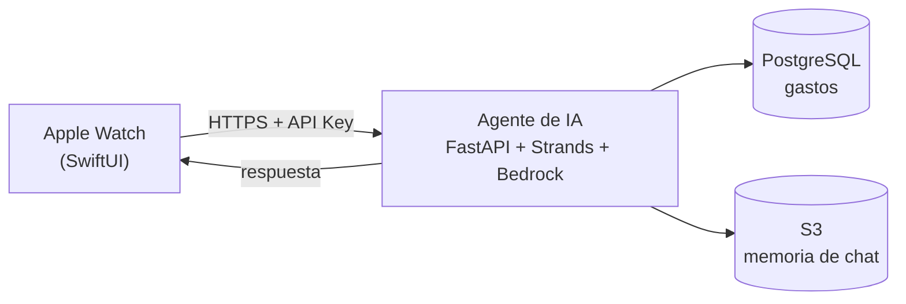

<div align="center">


# EasyFinance

### Habla. Se registra. Ya está.

**Tus finanzas personales, directo desde la muñeca.**
Sin teclado, sin apps de banco, sin abrir el celular.

<p>
  
  
  
</p>

</div>

<br/>

> *"gasté 25 soles en un uber al aeropuerto"* → categorizado, guardado y listo, en menos tiempo del que toma decir la frase.

<br/>

## ¿Por qué EasyFinance?

Casi todas las apps de finanzas personales fallan por lo mismo: **anotar un gasto cuesta más esfuerzo que el gasto en sí**. Abrir la app, buscar la categoría, escribir el monto, guardar... para un café de 5 soles, simplemente no lo haces dos veces.

EasyFinance apuesta por lo opuesto — **hablas, y ya quedó registrado.**

<br/>

## ✨ Lo que hace

| | |
|---|---|
| **Registro por voz** | Dicta el gasto como lo pensarías: *"almorcé por 15 soles"*. Sin formularios, sin categorías que elegir a mano. |
| **La IA hace el trabajo aburrido** | Categoría, subcategoría, moneda, método de pago, si es recurrente — todo se infiere solo del lenguaje natural. |
| **Conversa con tu dinero** | *"¿en qué gasto más?"*, *"¿cuánto llevo esta semana?"* — pregúntale y te responde en segundos, con memoria de la conversación. |
| **Nunca se pierde un gasto** | Sin señal en el reloj no es sin registro: se guarda localmente y se sincroniza solo en cuanto vuelve la red. |
| **Multi-moneda** | Soles y dólares, detectados automáticamente por contexto — *"gasté 20 dólares"* → USD, sin configurarlo. |
| **Todo a un vistazo** | Balance del día, últimos gastos y desglose por categoría, cacheados para que abrir la app sea instantáneo. |
| **Gastos recurrentes** | Reconoce solo suscripciones y renta como gasto fijo, sin que tengas que marcarlo. |

<br/>

## Cómo se ve en la práctica

```
🎙️  "gasté 25 soles en un uber al aeropuerto"
     ↓
🤖  El agente interpreta, categoriza y guarda
     ↓
📊  "Transporte: S/25.00 · Hoy vas en S/57.50"
```

Levantas la muñeca, dictas, y sigues con tu día. Eso es todo el flujo.

<br/>

---

<br/>

## Por dentro, para quien quiera meter mano

EasyFinance no es solo la app — es un sistema completo: cliente watchOS, un agente de IA con herramientas propias, e infraestructura como código para correrlo en AWS.

<div align="center">



</div>

1. **Dictas** un gasto o una pregunta con el dictado nativo de watchOS — Apple transcribe, la app solo recibe texto.
2. El texto viaja a un **agente de IA** en AWS Lambda, construido con [Strands Agents](https://github.com/strands-agents) sobre **Amazon Bedrock**.
3. El agente decide:
   - **¿Es un gasto?** → extrae categoría, monto, moneda, método de pago y lo guarda en PostgreSQL.
   - **¿Es una pregunta?** → genera SQL de solo lectura contra tu historial, acotado siempre a tu usuario, y responde en 3-5 líneas pensadas para leerse en el reloj.
4. El reloj cachea todo localmente para que abrir la app sea instantáneo.

### Arquitectura del repo

| Carpeta | Contenido |
| --- | --- |
| `swift/` | App SwiftUI para watchOS: vistas, view models, cliente de red, cola offline. |
| `components/ai-agent/` | Agente FastAPI + [Strands](https://github.com/strands-agents) sobre Amazon Bedrock, con herramientas para registrar y consultar gastos. |
| `infra/terraform/` | Infraestructura como código: Lambda Function URL, ECR, S3, IAM, SSM y logging. |

### Endpoints del agente

Todos requieren el header `X-Api-Key`. `/health` es el único público.

| Endpoint | Body | Propósito |
| --- | --- | --- |
| `POST /api/v1/log` | `{ "user_id": "…", "query": "…" }` | Extrae y guarda uno o varios gastos desde texto libre. |
| `POST /api/v1/chat` | `{ "user_id": "…", "query": "…" }` | Conversación con memoria sobre tus finanzas. |
| `POST /api/v1/spendings` | `{ "user_id": "…", "limit": 100 }` | Historial estructurado de gastos para la UI. |

### El "cerebro" del agente

Dos personalidades según el endpoint:

- **Logger** (`/log`) — silencioso, directo, solo extrae y guarda. Responde con una línea: `✓ Pasaje S/1.50 anotado.`
- **Chat** (`/chat`) — conversacional, registra *y* analiza. Traduce *"¿cuánto gasté esta semana?"* a SQL agregado por categoría, siempre acotado al `user_id` de la petición — nunca ve datos de otro usuario.

<br/>

## Empezando

### 1. Clona y configura el reloj

```bash
cp swift/Configuration/Secrets.xcconfig.example \
   swift/Configuration/Secrets.xcconfig
```

Define en tu copia local (no se versiona):

```xcconfig
EASYFINANCE_API_KEY = tu-api-key
EASYFINANCE_USER_ID = un-user-id-estable
```

Abre `swift/easyfinance.xcodeproj`, selecciona el scheme `easyfinance Watch App`, elige un simulador o reloj físico, y corre. El target ya incluye el permiso de micrófono necesario para el dictado.

### 2. Levanta o despliega el agente

En local, con Docker:

```bash
cd components/ai-agent
docker compose up
```

En AWS, construyendo y publicando una imagen nueva al Lambda existente:

```bash
source infra/terraform/.env
repository="$(terraform -chdir=infra/terraform output -raw ai_agent_ecr_repository_url)"
tag="$(date -u +%Y%m%d%H%M%S)"

aws ecr get-login-password --region "${AWS_REGION}" \
  | docker login --username AWS --password-stdin \
      "${TF_VAR_aws_account_id}.dkr.ecr.${AWS_REGION}.amazonaws.com"

docker buildx build --platform linux/amd64 \
  --tag "${repository}:${tag}" \
  --push components/ai-agent

function_name="$(terraform -chdir=infra/terraform output -raw ai_agent_lambda_name)"
aws lambda update-function-code \
  --region "${AWS_REGION}" \
  --function-name "${function_name}" \
  --image-uri "${repository}:${tag}"
aws lambda wait function-updated \
  --region "${AWS_REGION}" \
  --function-name "${function_name}"
```

### 3. Infraestructura

```bash
terraform -chdir=infra/terraform plan -out=tfplan
terraform -chdir=infra/terraform apply tfplan
```

Ver `infra/terraform/README.md` para el bootstrap completo (backend de estado, ECR inicial, importación del bucket de sesiones).

<br/>

## Notas de seguridad

- `Secrets.xcconfig` y los archivos de entorno están en `.gitignore`. Nunca commitees credenciales, estado de Terraform ni archivos generados de la app.
- Una API key embebida en un binario cliente puede extraerse. Es un gate de servicio, no autenticación por usuario. Para producción pública, coloca el agente detrás de API Gateway con tokens de corta duración (por ejemplo, Cognito) y deriva el `user_id` en el servidor.
- El endpoint de listado usa SQL parametrizado fijo. Las herramientas del agente están atadas a un único usuario por request, y todo el SQL analítico queda acotado a ese usuario.

<br/>

## Stack

| | |
|---|---|
| **App** | SwiftUI · watchOS · dictado nativo de WatchKit |
| **Agente** | Python · FastAPI · [Strands Agents](https://github.com/strands-agents) · Amazon Bedrock |
| **Infra** | AWS Lambda (Function URL) · ECR · S3 · IAM · SSM · Terraform |
| **Datos** | PostgreSQL (gastos) · S3 (memoria de conversación) |

<br/>

---

<div align="center">

Hecho para que registrar un gasto tome menos tiempo que pensarlo dos veces.

</div>
